# Hi 👋, I'm **Shanmuganathan S**

### AI & AI Agent Engineer • Founder at Zenvy Technologies

  

---

# 🚀 About Me

I'm **Shanmuganathan S**, a Computer Science Engineering student and the **Founder of Zenvy Technologies**, where I focus on building intelligent AI-powered products that solve real-world problems.

I believe that the best way to master technology is to build products that people can actually use.

### 🌟 My Mission

> Build impactful AI products, contribute to open source, and become a world-class AI & AI Agent Engineer.

---

## 💡 What I Do

- 🤖 Build AI Agents
- 🧠 Develop LLM-powered applications
- 🌐 Create Full Stack products
- 📱 Build Mobile AI experiences
- 🚀 Launch startup products through Zenvy Technologies
- 🔓 Contribute to Open Source

---

## 🏢 Founder Journey

| Role | Focus |
|------|-------|
| Founder | Zenvy Technologies |
| AI Builder | AI Agents & LLM Applications |
| Full Stack Developer | MERN Ecosystem |
| Product Builder | Turning ideas into products |

---

# 🔥 Featured Projects

## 🌟 SenseAble AI

AI accessibility assistant designed to help people with different abilities through intelligent real-world assistance.

### Highlights

- Computer Vision
- Voice AI
- Accessibility Assistant
- Mobile-first Experience
- AI-powered Navigation

**Tech Stack**

`React Native` `AI` `Computer Vision`

---

## 💼 ZenvyLance

AI-powered freelance ecosystem built by **Zenvy Technologies**.

### Features

- AI Validation Score
- Secure Escrow Payments
- Smart Freelancer Matching
- Intelligent Project Evaluation
- Razorpay Integration

**Tech Stack**

`React` `Node.js` `Express` `MongoDB`

---

## 🎙️ VoiceAI Mobile

Voice-controlled AI mobile automation assistant.

### Features

- Voice Commands
- AI Agents
- Mobile Automation
- Intelligent Task Execution

**Tech Stack**

`React Native` `Node.js` `Python`

---

## 📊 Student Grade Prediction Model

Machine Learning project that predicts student performance using **Scikit-learn's Logistic Regression**.

### Features

- Student Performance Prediction
- Data Preprocessing
- Feature Engineering
- Model Training & Evaluation
- Accuracy-based Performance Analysis

**Tech Stack**

`Python` `Scikit-learn` `Pandas` `NumPy` `Matplotlib` `Logistic Regression`

---

# 🛠️ Tech Stack

## 👨‍💻 Programming Languages

## 🤖 AI & Machine Learning

## 🌐 Full Stack

## 📱 Mobile & Systems

## ⚙️ Developer Tools

---

## 📊 GitHub Analytics

---

# 🔥 GitHub Streak

---

# 🐍 Contribution Snake

> Enable this after creating the GitHub Action.

---

# 🎯 Current Focus

| AI | Engineering | Startup |
|----|-------------|----------|
| AI Agents | Full Stack | Zenvy |
| LLM Apps | Open Source | Products |
| Deep Learning | Mobile AI | SaaS |

---

# 📚 Learning Roadmap

Currently exploring the next generation of AI technologies.

- Machine Learning
- Deep Learning
- AI Agents
- LLM Engineering
- RAG Systems
- Multi-Agent Systems
- AI Automation
- Real-world AI Products

---

# 🌍 Open Source Goals

- Publish AI projects
- Release Hugging Face demos
- Contribute to AI repositories
- Build reusable developer tools
- Share technical content

---

# 🏆 2026 Goals

- 🚀 Grow Zenvy Technologies
- 🤖 Build production-ready AI Agents
- 🌐 Launch globally used software
- 📈 Strengthen my GitHub portfolio
- 💼 Secure high-impact opportunities
- 🌍 Contribute consistently to Open Source

---

# 💭 Development Philosophy

## Learn → Build → Ship → Improve → Repeat

*"Don't just learn technology. Build something people can use."*

---

# 🌐 Connect With Me

---

# 🚀 Beyond Coding

Besides coding, I'm passionate about:

- 🧩 Product Thinking
- 🚀 Startup Building
- 🤖 Artificial Intelligence
- 🌍 Building software with real-world impact
- 📚 Continuous Learning
- 💡 Turning ideas into products

---

# ✨ Fun Fact

> I don't just build projects.

> I build products that move one step closer to my vision of creating intelligent software through **Zenvy Technologies**.

---

## Thanks for visiting! ❤️

### Building the future with AI, one product at a time.

