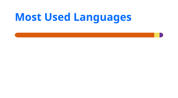

<div align="center">

# 👋 Hi, I'm **SHANMUGANATHAN S**

### 🤖 AI & AI Agent Engineer • 🦾 Robotics Explorer • 🔬 Aspiring AI Researcher • 🚀 Founder at Zenvy Technologies

<p align="center">
  
</p>

<p align="center">
  
  
  
</p>

</div>

---

# 🚀 About Me

I'm **SHANMUGANATHAN  S**, a Computer Science Engineering student, **AI & AI Agent Engineer**, aspiring researcher, and Founder of **Zenvy Technologies**.

I'm interested in understanding intelligence at a deeper level — not just using existing AI tools, but learning how intelligent systems work, building them from first principles, and exploring what is possible beyond today's AI.

My interests sit at the intersection of:

* 🤖 Artificial Intelligence
* 🧠 Machine Learning & Deep Learning
* 🧩 LLMs & AI Agents
* 🔎 AI Research
* 🦾 Robotics & Embodied AI
* 👁️ Computer Vision
* 🧮 Mathematics & Computational Science
* ⚡ AGI & Superintelligence
* 🚀 Technology & Product Building

I believe that becoming a strong engineer is about **building**, while becoming a strong scientist is about **questioning, experimenting, understanding, and discovering**.

I'm trying to grow in both directions.

---

# 🧠 My Mission

> **Build intelligent systems, explore fundamental questions, and contribute to technology and science in meaningful ways.**

My long-term vision is to work at the intersection of **AI, robotics, advanced machine intelligence, and scientific research**.

I want to move beyond simply implementing existing solutions and eventually contribute to the development of **new ideas, algorithms, systems, and scientific knowledge**.

---

# 🔬 Growing as a Scientist

I'm increasingly interested in research and fundamental scientific problems.

For me, research means:

* Asking difficult questions
* Understanding problems from first principles
* Studying mathematics behind systems
* Reading research papers
* Reproducing experiments
* Designing new experiments
* Testing hypotheses
* Learning from failures
* Building mathematical and computational intuition
* Sharing results openly

I'm especially interested in the relationship between **mathematics, computation, intelligence, and physical systems**.

### 🌌 Long-Term Scientific Ambition

One of my long-term ambitions is to study some of the deepest open problems in mathematics and computer science, including areas connected to the **Millennium Prize Problems**.

The goal isn't simply to claim that I will solve them.

The goal is to **develop enough mathematical maturity and scientific ability to seriously understand these problems and, one day, potentially contribute to solving fundamental open problems.**

---

# 🧠 Areas I'm Exploring

```text
Artificial Intelligence
│
├── Machine Learning
├── Deep Learning
├── Large Language Models
├── AI Agents
├── Multimodal AI
├── Reasoning Systems
│
├── Computer Vision
│
├── Robotics
│   ├── Perception
│   ├── Planning
│   ├── Navigation
│   ├── Control
│   └── Embodied AI
│
├── AI Research
│
├── Mathematics
│
├── AGI
│
└── Superintelligence
```

---

# 💡 What I Build

* 🤖 AI Agents
* 🧠 LLM-powered applications
* 🔎 RAG systems
* 🔄 AI automation systems
* 👁️ Computer Vision applications
* 🦾 Robotics experiments
* 🌐 Full-stack AI products
* 📱 AI-powered mobile applications
* 🚀 Startup products through Zenvy Technologies
* 🔓 Open-source projects
* 🔬 Research-oriented experiments

---

# 🏢 Zenvy Technologies

I'm the **Founder of Zenvy Technologies**, where I work on turning ideas into useful digital products.

Our interests include:

| Area         | Focus                     |
| ------------ | ------------------------- |
| 🤖 AI        | Intelligent applications  |
| 🧠 AI Agents | Autonomous task execution |
| 🌐 Web       | Full-stack products       |
| 📱 Mobile    | AI-powered experiences    |
| 🎨 Design    | Product & UI/UX           |
| 🚀 Products  | SaaS & startup ideas      |

> **Turning Ideas into Innovation.**

---

# 🔥 Featured Projects

## 🌟 SenseAble AI

### Universal AI Accessibility Assistant

An AI-powered accessibility concept designed to assist people with different accessibility needs through intelligent interaction and real-world assistance.

### Focus

* 👁️ Computer Vision
* 🎙️ Voice AI
* ♿ Accessibility
* 🤖 Intelligent Assistance
* 📱 Mobile Experience

**Tech:** `React Native` `AI` `Computer Vision`

---

## 💼 ZenvyLance

### AI-Powered Freelance Ecosystem

A freelance marketplace concept built around AI-assisted matching, verification, trust, and intelligent project evaluation.

### Features

* 🤖 AI Proposal Generation
* 🧠 Smart Freelancer Recommendations
* 🔐 AI Verification
* 📊 AI Trust Score
* 💳 Escrow Payment Concept
* 🔎 Intelligent Project Evaluation

**Tech:** `React` `Node.js` `Express` `MongoDB` `Groq`

---

## 🎙️ AI Mobile Automation Agent

### Voice-First Mobile AI Agent

An experimental AI agent designed to understand voice commands and execute tasks on mobile devices.

### Focus

* 🎙️ Voice Commands
* 🤖 AI Agents
* 📱 Mobile Automation
* 🧠 Task Planning
* ⚙️ Intelligent Execution

**Tech:** `React Native` `Node.js` `Python`

---

## 📊 Student Grade Predictor

A Machine Learning project for predicting student performance using supervised learning algorithms.

### Includes

* Data preprocessing
* Feature engineering
* Model training
* Model evaluation
* Classification analysis

**Tech:** `Python` `Pandas` `NumPy` `Scikit-learn` `Matplotlib`

---

# 🛠️ Technology Stack

## 👨‍💻 Programming Languages

<p align="left">

</p>

---

## 🤖 AI & Machine Learning

<p align="left">

</p>

<p align="left">


</p>

### Working With

`Machine Learning` `Deep Learning` `LLMs` `RAG` `AI Agents` `Multimodal AI` `Computer Vision`

---

## 🦾 Robotics & Intelligent Systems

Exploring the intersection of artificial intelligence and physical systems.

### Areas of Interest

`Robotics` `ROS 2` `Computer Vision` `Sensors` `Perception` `Navigation` `Control Systems` `Embodied AI`

---

## 🌐 Full Stack Development

<p align="left">

</p>

---

## 📱 Mobile & Systems

<p align="left">

</p>

---

## ⚙️ Developer Tools

<p align="left">

</p>

---

# 📊 GitHub Analytics

<div align="center">




</div>

---

# 🔥 GitHub Streak

<div align="center">


</div>

---

# 🐍 Contribution Snake

<div align="center">


</div>

---

# 🎯 Current Focus

<div align="center">

|      🤖 AI      |     🦾 Robotics     |      🔬 Research     | 🚀 Building |
| :-------------: | :-----------------: | :------------------: | :---------: |
|    AI Agents    |   Computer Vision   |      Mathematics     |    Zenvy    |
| LLM Engineering |      Perception     |      AI Research     | AI Products |
|  Deep Learning  |     Embodied AI     | Scientific Computing | Open Source |
|   RAG Systems   | Intelligent Systems |     Open Problems    |  Hackathons |

</div>

---

# 🔬 Research Interests

I'm interested in exploring questions around:

* How can intelligent systems reason more effectively?
* How can AI agents learn to plan and act autonomously?
* How can LLMs interact reliably with the physical world?
* How can robots develop stronger perception and reasoning?
* How can AI systems learn continuously?
* How can mathematical ideas lead to better computational intelligence?
* What are the fundamental limits of computation and intelligence?
* What could the path from today's AI systems toward AGI look like?
* How can increasingly capable AI systems remain safe and aligned?

I'm still early in this journey, but I'm committed to developing the mathematical, computational, and scientific foundations required to explore these questions seriously.

---

# 🌌 Open Problems & Scientific Curiosity

I'm fascinated by problems that sit at the boundary of what humanity currently understands.

In the long term, I want to study areas related to major open problems in:

* 🧮 Mathematics
* 💻 Theoretical Computer Science
* 🤖 Artificial Intelligence
* 🌌 Physics & Computational Science

The **Millennium Prize Problems** are a major source of inspiration for this goal.

Rather than treating them as a checklist, I see them as a reminder of how much remains unknown — and as motivation to develop the mathematical depth required to contribute to fundamental research.

> **Understand deeply. Question everything. Experiment relentlessly.**

---

# 🌍 Open Source Goals

I want to contribute to the developer and research community by:

* 🔓 Publishing useful AI projects
* 🤗 Building Hugging Face demos
* 🧠 Contributing to AI/ML repositories
* 🛠️ Creating reusable developer tools
* 🔬 Publishing research experiments
* 📚 Sharing what I learn
* 🚀 Participating in hackathons
* 🌍 Collaborating with researchers and builders

---

# 🏆 2026 Goals

* 🤖 Build production-ready AI Agents
* 🧠 Strengthen Deep Learning & LLM fundamentals
* 🦾 Begin serious Robotics projects
* 👁️ Explore Computer Vision & Embodied AI
* 🔬 Develop stronger research and mathematical foundations
* 📚 Read and reproduce research papers
* 🚀 Grow Zenvy Technologies
* 🌐 Build and launch useful AI products
* 🔓 Contribute consistently to Open Source
* 🧪 Start research-oriented experiments
* 💼 Pursue high-impact AI opportunities

---

# 💭 My Philosophy

<div align="center">

## **Learn → Build → Research → Experiment → Ship → Improve**

> *"Don't just use intelligent systems. Understand them, build them, and question what is possible."*

</div>

---

# 🚀 Beyond Coding

I'm interested in much more than writing software.

I enjoy exploring:

* 🧠 How intelligence works
* 🧮 Mathematics and fundamental problems
* 🤖 Artificial Intelligence
* 🦾 Robotics
* 🔬 Scientific research
* 🚀 Startup & product building
* 🌍 Emerging technologies
* 📚 Continuous learning
* 💡 Turning ideas into experiments and products

---

# ✨ Fun Fact

> I don't want to simply become a better programmer.
>
> **I want to become an engineer who builds, a researcher who questions, and a scientist who explores problems that don't yet have answers.**

---

# 🌐 Connect With Me

<div align="center">

<a href="https://linkedin.com/in/shanmuganathan23">

</a>

<a href="https://github.com/agentshanz">

</a>

<a href="https://shan-official-portfolio.netlify.app/">

</a>

<a href="https://zenvytechnologies.vercel.app/">

</a>

</div>

---

<div align="center">

## ❤️ Thanks for visiting!

### **Building. Researching. Exploring the unknown.**


</div>
